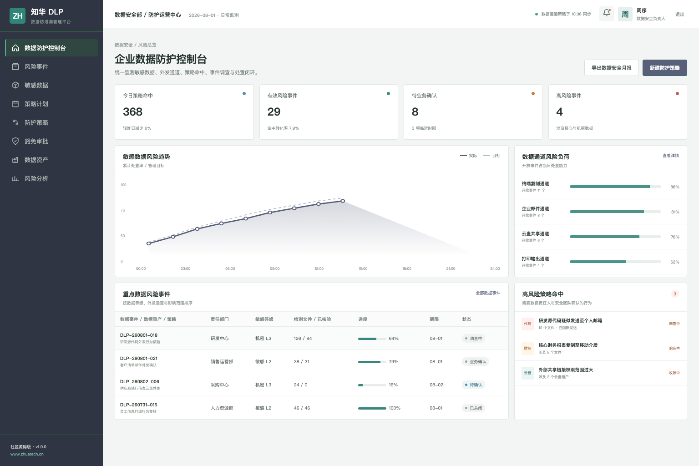
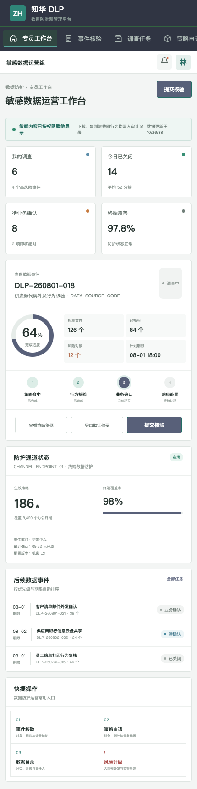

# 知华科技 DLP 数据防泄漏管理平台

`ZhuaTech DLP` · 社区源码版 · 前后端分离 · 管理端 + H5

由知华科技（上海如静知华信息科技有限公司）发布，用于展示企业敏感数据识别、外发通道防护、风险事件调查与业务豁免流程的工程实现。了解知华科技及企业信息化服务，请访问[官方网站](https://www.zhuatech.cn/)。

## 产品画面

| 企业数据防护控制台 |
| --- |
|  |

控制台将终端、邮件、云盘和打印等数据通道的策略命中统一归并为可处理事件，并呈现敏感等级、责任部门、影响对象和处置进度。

| 数据安全专员移动工作台 |
| --- |
|  |

移动端用于事件核验、业务确认、策略豁免、数据目录查询和重大风险升级，让现场沟通保留完整审计轨迹。

## 能力范围

- 数据分类分级、内容识别规则、关键词与文件指纹
- 终端复制、邮件外发、云盘共享、打印输出等通道策略
- 策略命中聚合、行为核验、证据留存和风险评分
- 有期限的业务豁免、例外审批与补偿控制
- 数据责任人协同、重大事件升级和风险分析

> 仓库中的数据、企业名称、文件数量和事件均为虚构演示内容，不提供真实监控或绕过安全控制的能力。

## 项目结构

```text
zhuatech-dlp/
├── backend/       Java 21 + Spring Boot API
├── frontend/      Vue 3 管理端和 H5
├── docs/          架构、接口、数据库与产品截图
├── deploy/        部署说明
└── compose.yaml   MySQL 与应用编排
```

后端包名为 `cn.zhuatech.dlp`，数据库名为 `zhuatech_dlp`。认证使用 Spring Security 与 JWT，数据库演进使用 Flyway，集成测试使用 H2。

## 快速预览

```bash
cd frontend
npm install
npm run dev:demo
```

访问 `http://localhost:5173`。管理端登录 `planner / Demo@2026`，专员端登录 `operator / Demo@2026`。Docker 方式参考 [部署说明](deploy/README.md)，接口参考 [API 文档](docs/api.md)。

## 使用限制

该工程仅限个人学习、研究和非商业技术交流，**不得用于任何商业用途**。企业内部部署、生产使用、SaaS、项目交付、收费培训、咨询实施、安全运营服务、品牌替换与商业再分发均需上海如静知华信息科技有限公司书面授权，完整约束见 [LICENSE](LICENSE)。

如需数据安全治理、DLP 平台集成、私有化部署或深度开发定制，请访问[知华科技官网](https://www.zhuatech.cn/)或扫码添加微信咨询。

| 微信咨询一 | 微信咨询二 |
| --- | --- |
|  |  |

SEO 关键词：DLP 系统源码、数据防泄漏、敏感数据识别、数据分类分级、终端数据安全、邮件防泄漏、Java DLP、Vue 数据安全、知华科技。

## 数据外发策略判断

新增 `POST /api/admin/egress-policy`，综合数据分类、外发渠道、外部接收人、加密状态、记录数量和例外审批，输出 `ALLOW / REVIEW / BLOCK`。受限数据的大批量未加密外发会被阻断并通知安全负责人。

## 大批量传输风险

新增 `POST /api/dlp/insights/bulk-transfer-risk`。接口结合数据分级、记录数量、目标可信度、加密审批、异常行为及可移动介质等信号生成风险分，并返回 `ALLOW`、`REVIEW` 或 `BLOCK`，为批量导出和外发任务提供一致的策略门禁。
